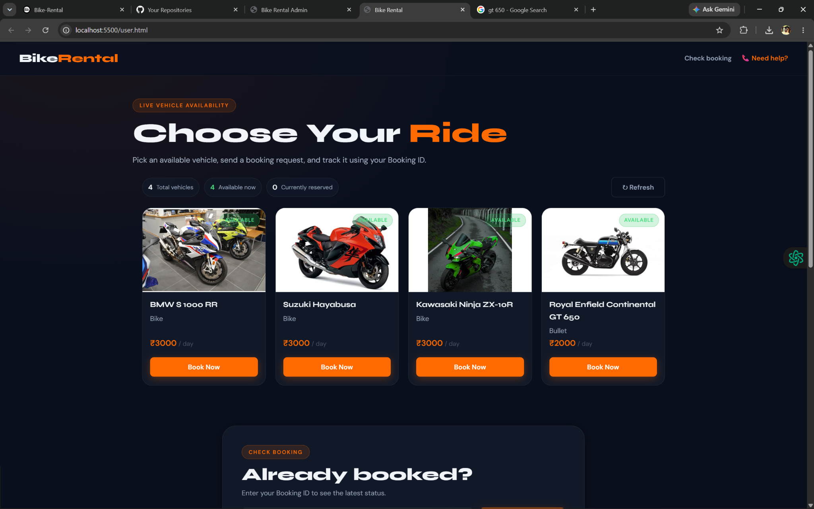
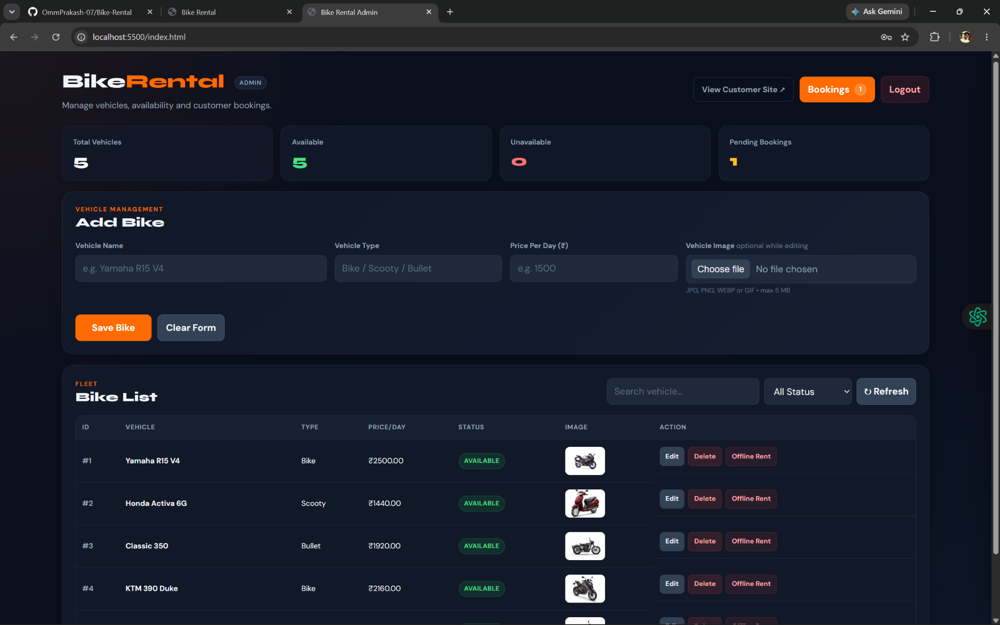
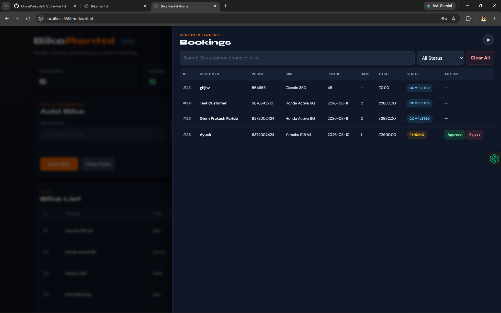

# 🏍️ Bike Rental Management System

A full-stack **Bike Rental Management System** built with **Spring Boot, MySQL, HTML, CSS, and JavaScript**. The project provides a customer-facing rental interface and an admin dashboard for managing vehicles, bookings, availability, and uploaded vehicle images.

The frontend is deployed on **Vercel**, while the backend, database, and persistent image storage are hosted on **Railway**.

## 🌐 Live Project

- **Customer Website:** https://bike-rental-phi.vercel.app/
- **Admin Login:** https://bike-rental-phi.vercel.app/login.html
- **Backend API:** https://bike-rental-production-6e17.up.railway.app
- **Health Check:** https://bike-rental-production-6e17.up.railway.app/api/health

### Admin Access

Admin login is available at:

`/login.html`

Admin credentials are managed securely through deployment environment variables and are not stored or published in this repository.

> For security reasons, admin credentials are not included in this README.

---

## 📸 Screenshots

### Customer Side



### Admin Dashboard



### Booking Management



---

## ✨ Features

### Customer

- View all rental vehicles with live availability.
- View vehicle type, image, and rental price per day.
- Book an available vehicle through a proper booking form.
- Enter pickup date and rental duration.
- Automatic total rental amount calculation.
- Receive a unique **Booking ID** after a successful booking request.
- Check booking status using the Booking ID.
- Clear availability states for available and reserved vehicles.
- Responsive interface for desktop and mobile.
- Client-side validation for customer name, phone number, pickup date, duration, and Booking ID.

### Admin

- Admin login interface.
- Dashboard counters for total, available, unavailable, and pending bookings.
- Add new vehicles with image upload.
- Edit vehicle information.
- Delete vehicles.
- Mark a vehicle unavailable for offline rental.
- Mark returned vehicles available again.
- Search and filter vehicles.
- View booking requests.
- Search and filter bookings.
- Approve or reject pending booking requests.
- Booking lifecycle management.
- Uploaded image preview and validation.

### Backend

- REST API built with Spring Boot.
- MySQL persistence using Spring Data JPA.
- Automatic booking ID generation.
- Server-side validation.
- Duplicate/conflicting booking protection.
- Vehicle reservation when a booking request is created.
- Approved bookings keep vehicles unavailable.
- Returning a vehicle completes its active booking.
- CORS configuration for the deployed frontend.
- Persistent vehicle image storage using a Railway Volume.
- Environment-variable based database configuration.

---

## 🔄 Booking Flow

```text
AVAILABLE VEHICLE
      ↓
Customer submits booking request
      ↓
PENDING
      ↓
Vehicle becomes reserved/unavailable
      ↓
Admin reviews request
   ↙          ↘
REJECTED     APPROVED
   ↓             ↓
Available     Rental active
                 ↓
          Vehicle returned
                 ↓
             COMPLETED
                 ↓
             AVAILABLE
```

---

## 🛠️ Tech Stack

| Layer | Technology |
|---|---|
| Frontend | HTML5, CSS3, JavaScript |
| Backend | Java, Spring Boot |
| API | REST |
| ORM | Spring Data JPA / Hibernate |
| Database | MySQL |
| Backend Hosting | Railway |
| Database Hosting | Railway MySQL |
| Image Storage | Railway Volume |
| Frontend Hosting | Vercel |
| Version Control | Git & GitHub |

---

## 🏗️ Architecture

```text
                 ┌────────────────────────────┐
                 │       Vercel Frontend      │
                 │ HTML + CSS + JavaScript    │
                 └─────────────┬──────────────┘
                               │ HTTPS / REST
                               ▼
                 ┌────────────────────────────┐
                 │    Railway Spring Boot     │
                 │        REST Backend        │
                 └──────────┬─────────┬───────┘
                            │         │
                            │         │ image files
                            ▼         ▼
                  ┌──────────────┐  ┌───────────────┐
                  │ Railway MySQL│  │ Railway Volume│
                  │ bikes/bookings│ │ /data/uploads │
                  └──────────────┘  └───────────────┘
```

---

## 📁 Project Structure

```text
Bike-Rental/
│
├── backend/
│   ├── src/
│   │   ├── main/
│   │   │   ├── java/
│   │   │   │   └── bikerental/
│   │   │   └── resources/
│   │   │       └── application.properties
│   │   └── test/
│   ├── pom.xml
│   ├── mvnw
│   └── mvnw.cmd
│
├── frontend/
│   ├── index.html          # Customer homepage
│   ├── admin.html          # Admin dashboard
│   ├── login.html          # Admin login
│   ├── user.js
│   ├── script.js
│   ├── config.js
│   ├── user.css
│   └── ...
│
├── docs/
│   └── screenshots/
│       ├── user-dashboard.png
│       ├── admin-dashboard.png
│       └── admin-bookings.png
│
├── .gitignore
└── README.md
```

---

## 🔌 Main API Endpoints

### Health

```http
GET /api/health
```

### Vehicles

```http
GET    /api/bikes
POST   /api/bikes
PUT    /api/bikes/{id}
DELETE /api/bikes/{id}
PUT    /api/bikes/{id}/available
PUT    /api/bikes/{id}/unavailable
```

### Bookings

```http
GET  /api/bookings
GET  /api/bookings/{id}
POST /api/bookings
PUT  /api/bookings/{id}/approve
PUT  /api/bookings/{id}/reject
```

> Exact endpoints may evolve as the project continues. Keep this section synchronized with the backend controllers.

---

## 💻 Run Locally

### Prerequisites

- Java 21+ / compatible JDK
- MySQL 8+
- Python 3 (optional, only for serving the static frontend locally)
- Git

### 1. Clone the repository

```bash
git clone https://github.com/OmmPrakash-07/Bike-Rental.git
cd Bike-Rental
```

### 2. Create the database

```sql
CREATE DATABASE bike_rental;
```

### 3. Configure backend environment variables

PowerShell example:

```powershell
$env:MYSQLHOST="localhost"
$env:MYSQLPORT="3306"
$env:MYSQLDATABASE="bike_rental"
$env:MYSQLUSER="root"
$env:MYSQLPASSWORD="YOUR_MYSQL_PASSWORD"
```

### 4. Start the backend

```powershell
cd backend
.\mvnw.cmd spring-boot:run
```

Backend runs at:

```text
http://localhost:8080
```

### 5. Start the frontend

Open another terminal:

```powershell
cd frontend
python -m http.server 5500
```

Customer site:

```text
http://localhost:5500/
```

Admin login:

```text
http://localhost:5500/login.html
```

---

## ⚙️ Frontend API Configuration

The deployed Railway backend URL is configured in:

```text
frontend/config.js
```

Example:

```javascript
window.BIKE_RENTAL_CONFIG = {
  API_BASE_URL:
    localStorage.getItem("bikeRentalApiBaseUrl") ||
    "https://bike-rental-production-6e17.up.railway.app"
};
```

For local development, the browser API override can be changed to:

```text
http://localhost:8080
```

---

## 🚀 Deployment

### Backend — Railway

The repository contains both frontend and backend. The Railway backend service uses:

```text
Root Directory: /backend
```

Required database variables:

```text
MYSQLHOST
MYSQLPORT
MYSQLDATABASE
MYSQLUSER
MYSQLPASSWORD
```

Persistent image storage:

```text
UPLOAD_DIR=/data/uploads
```

Railway Volume mount:

```text
/data/uploads
```

### Frontend — Vercel

Vercel uses:

```text
Root Directory: frontend
```

Production customer homepage:

```text
/
```

Admin login:

```text
/login.html
```

Admin dashboard:

```text
/admin.html
```

---

## ✅ Current Project Status

- [x] Spring Boot backend
- [x] MySQL integration
- [x] Vehicle CRUD
- [x] Vehicle image upload
- [x] Persistent Railway image volume
- [x] Customer vehicle listing
- [x] Booking form
- [x] Rental duration
- [x] Automatic price calculation
- [x] Booking ID generation
- [x] Booking status lookup
- [x] Admin booking management
- [x] Approve/reject workflow
- [x] Duplicate booking protection
- [x] Vehicle availability lifecycle
- [x] Frontend validation
- [x] Backend validation
- [x] Responsive UI polish
- [x] Railway backend deployment
- [x] Railway MySQL deployment
- [x] Vercel frontend deployment

---

## 🔮 Possible Future Improvements

- Secure admin authentication with Spring Security and hashed credentials.
- User accounts and rental history.
- Online payment integration.
- Booking cancellation workflow.
- Date-range availability instead of one active reservation per vehicle.
- Email/SMS booking notifications.
- Admin analytics and revenue reports.
- Cloud object storage/CDN for larger-scale image hosting.
- Automated backend tests and CI/CD checks.

---

## 👨‍💻 Project Purpose

This project was developed as a **major/academic project** to demonstrate practical full-stack development using Java, Spring Boot, MySQL, REST APIs, frontend JavaScript, deployment, persistent storage, validation, and real booking workflow management.

---

## 📄 License

This project is currently intended for educational and demonstration purposes.
